# Game Basic Information #
The game is a story-driven survival RPG set in a post-apocalyptic world where every choice affects the player’s fate
and the world’s state. Players must manage resources and health while exploring decayed cities, forests, and ruins. Combat uses a real-time action system blending melee, ranged, and improvised weapons. The survival mechanics emphasize scarcity and strategy—deciding when to fight, flee, trade, or rest can mean the difference between life and death. Environmental hazards like radiation, weather, and hunger add constant tension, requiring tactical planning and emotional resilience.
## Summary ##
The aesthetic design will be 2D retro-futuristic, pixel-art post-apocalyptic backgrounds with pixel main characters
Similar artistic designs are Long Gone, Kingdom. The action system will look like Celeste that includes dash and vertical movement, interacting with objects like doors/ladders will look like Rust so as long as you approach the instances you can interact. The crafting system will look like other survival games with a set of raw materials that you can collect then use them to synthesize a variety of gears, imaging how you can make different types of bullets in Resident Evil with only powder and metals. 

## Gameplay Explanation ##
Players can interact with the environment and other survivors. Each encounter presents multiple paths—helping 
strangers may earn allies or betrayals, while ignoring others might secure short-term safety but long-term loneliness. Players can scavenge materials and craft gears, shaping their personal survival space. The environment itself tells silent stories through abandoned buildings, graffiti, and remnants of the old world, inviting players to piece together humanity’s collapse. Dynamic AI ensures that NPCs and monsters react differently depending on the player’s actions and reputation, creating a living, reactive world.

The story follows a lone wanderer navigating the ruins of civilization, struggling to hold onto humanity in a world 
stripped of hope. Along the journey, the player meets other survivors—each with their own tragic pasts, motives, and moral boundaries. Through dialogue choices and branching decisions, the player uncovers hidden truths about the apocalypse and faces hard moral dilemmas: who to save, who to sacrifice, and what kind of person to become in the end. 

# Main Roles #
- Lead Developer, Gameplay & Systems Design: Siyun Chen
- User Interface & Narrative design: William Yu
- Systems and Tools Engineer: Alex Yuan
- Main character Props: Zijian Li
- Map design: Fanxi Xu
- AI design: Yuanzhen Wu

## Characters, Story & Scene Design (Siyun Chen)

### Asset Collection & Audio Processing

I was responsible for sourcing and purchasing all visual and audio assets used in this project. Finding appropriate post-apocalyptic themed assets that matched our artistic vision required extensive research across multiple asset marketplaces. Each asset pack was evaluated for visual consistency, animation quality, and licensing terms before integration into the project.

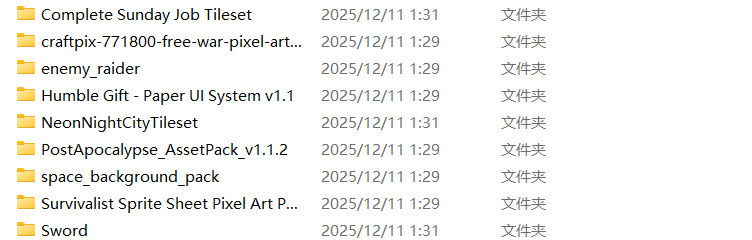
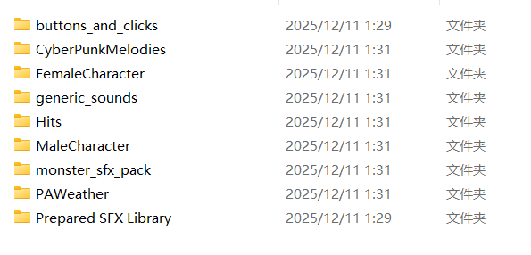

**Visual Assets Sources:**

| Asset Pack | Source | Usage in Project |
|-----------|--------|-----------------|
| [Survivalist Sprite Sheet Pixel Art Pack](https://craftpix.net/product/survivalist-sprite-sheet-pixel-art-pack/) | CraftPix.net | Three playable character sprites with full animation sets (idle, walk, run, jump, attack, shoot, hurt, death) |
| [Free Raider Sprite Sheets Pixel Art](https://craftpix.net/freebies/free-raider-sprite-sheets-pixel-art/) | CraftPix.net | Enemy raider character sprites with combat animations |
| [Post-Apocalypse Pixel Art Asset Pack](https://thelazystone.itch.io/post-apocalypse-pixel-art-asset-pack) | itch.io (TheLazyStone) | UI elements (health bars, stamina bars), environmental tiles, and object sprites |
| [Free War Pixel Art 2D Backgrounds](https://craftpix.net/freebies/free-war-pixel-art-2d-backgrounds/) | CraftPix.net | Multi-layer parallax backgrounds (sky, distant buildings, near buildings, ground) |
| [Neon Night City Tileset](https://deadrevolver.itch.io/neon-night-city-tileset) | itch.io (Dead Revolver) | Indoor environment tiles for interior scenes |
| [Humble Gift - Paper UI System](https://humblepixel.itch.io/pocket-inventory-series-5-player-status) | itch.io (Humble Pixel) | Character selection UI frames, decorative panels |
| [32Bit House Tileset](https://thatguyesso.itch.io/house-and-extras-tileset) | itch.io (ThatGuyEsso) | Complete Sunday Job Tileset for environmental variety |
| Space Background Pack | Various | Cutscene space backgrounds, orbital cannon satellite animations |

**Audio Assets & Processing:**

All character voice audio files required extensive post-processing. The original assets came as single long audio tracks containing multiple sound effects recorded sequentially. Using **Audacity**, I performed the following workflow for each voice pack:

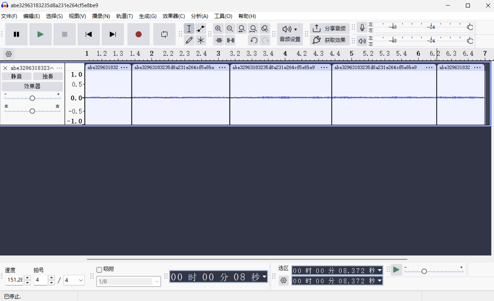

1. **Noise reduction** to clean up background hiss
2. **Silence detection** to identify individual sound boundaries
3. **Manual slicing** to separate each sound effect
4. **Normalization** to ensure consistent volume levels
5. **Export and naming** following our naming convention (e.g., `male1_hurt.wav`, `female_death2.wav`)

The processed audio files are organized in [audio/MaleCharacter](final-proj/audio/MaleCharacter) (containing hurt, death, hit, and jump variations for two male voice types) and [audio/FemaleCharacter](final-proj/audio/FemaleCharacter) (containing similar variations for the female character). Each category contains 3-6 variations to prevent audio fatigue during gameplay.

**Weapon Sound Effects:**

The [Prepared SFX Library](final-proj/audio/Prepared%20SFX%20Library) contains realistic weapon sounds organized by firearm type:
- **AK-47**: Used for enemy Raider_AK47 with near/far shot variations
- **1911**: Mira's pistol sounds (7-round magazine reload sounds)
- **1917**: Jonah's revolver sounds (6-cylinder reload sounds)
- **AR-15/SKS**: Elias's rifle sounds (single-shot reload)

Impact sounds in [audio/Hits](final-proj/audio/Hits) include Metal Hit (6 variations), Wood Hits (3 variations), and generic impact sounds, selected dynamically based on the target's material type.

---

### Three Playable Characters System

I designed and implemented the complete character system featuring three distinct playable classes. Rather than simply providing cosmetic differences, each character has fundamentally different gameplay mechanics that affect combat strategy, exploration pace, and resource management.

The character system architecture is built around the `CharacterClass` enum defined in [Player.gd](final-proj/scripts/Player.gd): When the game starts, the `_apply_class_stats()` function reads `Global.selected_class` and configures all character parameters accordingly. This function is also called when loading a saved game to ensure stats match the saved character selection.

**Character Stats Comparison:**

| Stat | Elias (BALANCED) | Mira (SPEED) | Jonah (TANK) |
|------|-----------------|--------------|--------------|
| Max Health | 100 | 80 | 140 |
| Max Stamina | 100 | 80 | 130 |
| Walk Speed | 90 | 100 | 80 |
| Run Speed | 220 | 250 | 200 |
| Stamina Regen Rate | 18/sec | 20/sec | 15/sec |
| Stamina Run Cost | 22/sec | 30/sec | 18/sec |
| Melee Damage | 20 | 18 | 22 |
| Gun Damage | 45 | 30 | 32 |
| Weapon Type | Rifle | 1911 Pistol | 1917 Revolver |
| Magazine Size | 1 (bolt-action) | 7 | 6 |
| Voice Type | Male 1 | Female | Male 2 |

**Weapon System Implementation:**

Each character uses a different `WeaponKind` enum value (line 30), which affects reload behavior. The rifle uses `_reload_one_round()` (lines 474-484) which adds a single bullet per reload animation, simulating bolt-action operation. Pistols use `_reload_full_mag()` (lines 486-498) which refills the entire magazine from reserve ammo in one reload cycle.

The weapon's feel is further differentiated through distinct audio:

- Elias's rifle has a powerful, echoing shot with a slow reload
  
- Mira's 1911 has a sharp, quick shot with a magazine slap reload
  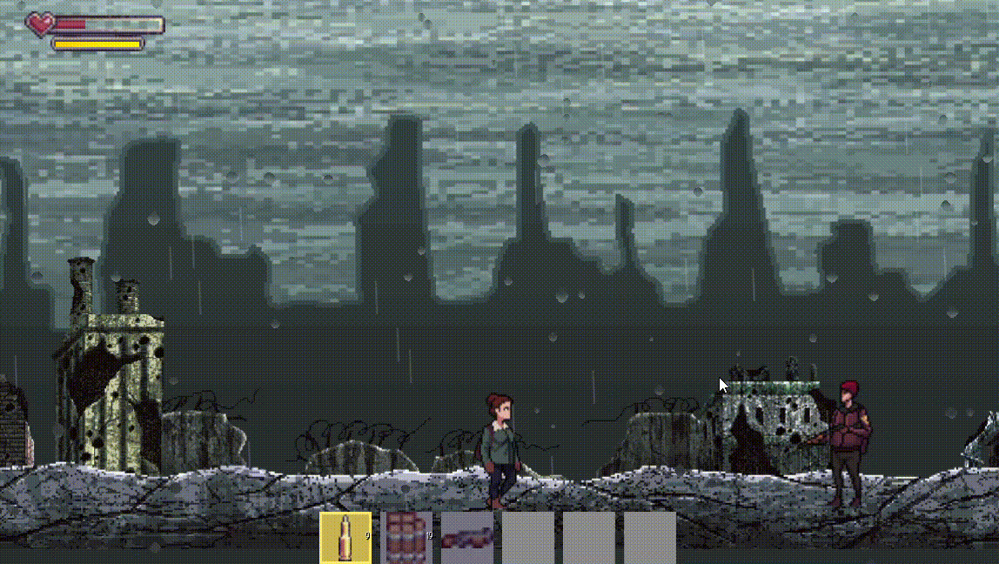
- Jonah's revolver has a heavy thud with individual round loading sounds
  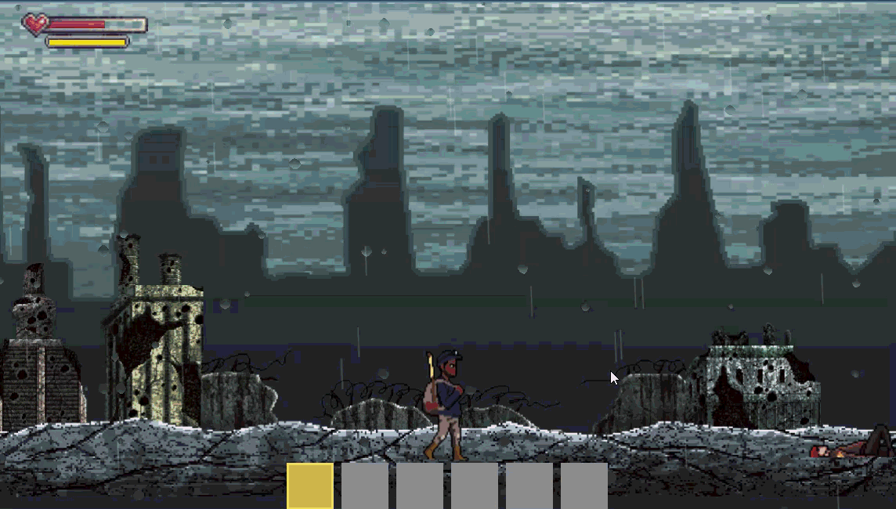

**Animation Binding:**

  
  
Each character has a unique `SpriteFrames` resource assigned via the `frames_balanced`, `frames_speed`, and `frames_tank` export variables. These are swapped in `_apply_class_stats()`, ensuring the correct sprite sheet is used for all animations. The animation names (idle, walk, run, jump, attack_1, attack_2, shot, recharge, hurt, dead) are consistent across all three sprite sheets, allowing the animation state machine to work identically regardless of character selection.

**Voice Clip System:**

The `_load_audio_for_class()` function dynamically populates audio arrays based on character selection. For each character, separate arrays are maintained for:
- `jump_voice_clips`: Effort sounds when jumping (3 variations)
- `attack_voice_clips`: Battle cries during melee attacks (3 variations)
- `light_hurt_voice_clips`: Minor damage reactions (5 variations)
- `heavy_hurt_voice_clips`: Major damage reactions (3 variations)
- `death_voice_clips`: Death sounds (4 variations)

To prevent repetitive audio, the player script tracks the last-used index for each category and ensures the same clip isn't played twice consecutively.

---

### Projectile System

I wrote the complete projectile system in [scripts/projectile.gd](final-proj/scripts/projectile.gd). When a player fires their weapon, `_spawn_projectile()` instantiates a projectile at the muzzle position and calls the `setup()` method with direction, damage, shooter reference, and default hit material.

The projectile physics work as follows:

1. **Movement**: Each frame, the projectile moves along its direction vector at `speed` (default 3000 pixels/second), tracking total distance traveled
2. **Range limit**: When `traveled >= max_distance` (default 900 pixels), the projectile self-destructs
3. **Collision detection**: Using `get_overlapping_bodies()`, the projectile checks for hits, ignoring its own shooter
4. **Damage falloff**: Damage decreases by up to 20% based on distance traveled: `damage_factor = 1.0 - 0.2 * (traveled / max_distance)`
5. **Material-based feedback**: The hit target's `get_hit_material()` method determines which impact sound plays

This system prevents bullets from hitting the shooter, provides satisfying audio feedback based on what was hit, and adds tactical depth through damage falloff at range.

---

### Enemy System - Raider & Raider AK47

I created the **Raider AK47** variant ([scripts/enemies/enemy_raider_AK47.gd](final-proj/scripts/enemies/enemy_raider_AK47.gd)) and performed a complete overhaul of the base **Raider** enemy ([scripts/enemies/enemy_raider.gd](final-proj/scripts/enemies/enemy_raider.gd)). The original raider implementation had several critical issues that made it unsuitable for actual gameplay.


**Critical Bugs Fixed:**

1. **Sprite Offset Drift**: The original raider sprite was not centered, causing the visual position to shift dramatically when changing facing direction. I implemented a `sprite_left_offset` system that compensates for asymmetric sprites by applying an X-axis offset when `flip_h` is true. The `_update_directional_offsets()` function (lines 160-197) recalculates all node positions whenever the enemy changes direction.

2. **Player-Enemy Collision Blocking**: Players would get stuck against enemies, unable to pass through them. I reconfigured the collision layers which allows physical separation while still permitting Area2D-based damage detection.

3. **Dead Enemy Bullet Blocking**: When enemies died, their collision shapes remained active, blocking player projectiles. The death state now properly disables all collision.

4. **Directional Node Misalignment**: Attack areas, hurtboxes, and shoot points were not mirroring correctly. I implemented an offset caching system that stores original positions on `_ready()` and applies proper mirroring in `_update_directional_offsets()`.

**Behavior System:**

The raider uses a finite state machine with two configurable behavior types:

**GUARD Behavior:**
- Remains stationary at spawn position
- Chases player only within `guard_chase_distance` (default 100 pixels)
- Returns to home position if player moves too far
- Primarily uses melee attacks

**PATROL Behavior:**
- Walks back and forth within `patrol_range` (default 200 pixels) from spawn
- Pauses at patrol endpoints for `patrol_wait_time` (default 1.5 seconds)
- Chases player within `patrol_chase_distance` (default 300 pixels)
- Uses ranged attacks when player is beyond `shoot_range` (default 200 pixels)

The state machine handles transitions between: `IDLE`, `PATROL`, `CHASE`, `ATTACK`, `AIMING`, `SHOOT`, `RECHARGE`, `COOLDOWN`, `HURT`, `DEATH`, and `RETURNING`.

**Raider AK47 Variant:**

The AK47 variant extends the base raider with magazine-based shooting mechanics:
- `magazine_size`: 30 rounds before reload
- `near_shoot_range`: 300 pixels - threshold for burst vs. single shot
- Two shooting modes: `SHOOT_NEAR` (rapid fire) and `SHOOT_FAR` (aimed single shots)
- Dedicated audio for near/far shooting and reload

---

### Complete Story System

I designed and wrote the entire narrative framework for the game, creating a branching storyline where each of the three playable characters experiences a unique journey through the post-apocalyptic world. The story explores themes of memory manipulation, institutional control, and personal identity in a society where memories can be edited or erased.

**Narrative Architecture:**

The story unfolds across four major locations, with each character visiting them in a different order and experiencing different events:

| Scene | Location | Visiting Characters | Key Story Elements |
|-------|----------|-------------------|-------------------|
| S1 | City Outskirts | All three | Character introductions, establishing motivations |
| S2 | Old Gate Checkpoint | Elias, Mira | Memory Bureau secrets, surveillance discovery |
| S3 | Grey Bazaar Ruins | Mira, Jonah | Underground networks, rumors of system collapse |
| S4 | Perimeter Relay | Elias, Jonah | Technical infrastructure, critical choices |

**Character Story Routes:**

- **Elias (S1 → S2 → S4)**: A former Memory Bureau technician haunted by guilt. His route focuses on uncovering the truth about the memories he helped erase and confronting the Bureau's cover-ups.

- **Mira (S1 → S3 → S2)**: A courier who discovers her delivery contains something the Bureau wants buried. Her route emphasizes survival, building trust with underground contacts, and evading Bureau surveillance.

- **Jonah (S1 → S4 → S3)**: A network architect who built parts of the memory infrastructure. His route explores the technical and ethical implications of the system, culminating in a choice that affects the game world.

**Implementation Details:**

The story system is built around the [StoryDialogueLibrary](final-proj/scripts/story/story_dialogue_library.gd) class, which serves as a central routing hub for all dialogue content. The `build_dialogue()` static function (lines 50-102) takes three parameters:
- `scene_id`: Which location ("s1", "s2", "s3", "s4")
- `character_id`: Which protagonist ("elias", "mira", "jonah")
- `trigger_key`: Which specific dialogue within that scene ("main", "terminal", "vendor", etc.)

These are combined into a lookup key (e.g., "s2_elias_terminal") that maps to the appropriate dialogue builder function. This architecture allows the game to dynamically load the correct dialogue based on current scene, selected character, and trigger location.

**Dialogue Content Organization:**

Each scene has its own subfolder containing character-specific dialogue scripts:
- [s2_checkpoint/elias_s2_dialogues.gd](final-proj/scripts/story/s2_checkpoint/elias_s2_dialogues.gd): Elias discovers deleted memory logs
- [s2_checkpoint/mira_s2_dialogues.gd](final-proj/scripts/story/s2_checkpoint/mira_s2_dialogues.gd): Mira is scanned by Bureau equipment
- [s3_bazaar/mira_s3_dialogues.gd](final-proj/scripts/story/s3_bazaar/mira_s3_dialogues.gd): Mira meets underground contacts
- [s3_bazaar/jonah_s3_dialogues.gd](final-proj/scripts/story/s3_bazaar/jonah_s3_dialogues.gd): Jonah hears rumors about network failures
- [s4_relay/elias_s4_dialogues.gd](final-proj/scripts/story/s4_relay/elias_s4_dialogues.gd): Elias experiences memory echoes
- [s4_relay/jonah_s4_dialogues.gd](final-proj/scripts/story/s4_relay/jonah_s4_dialogues.gd): Jonah investigates system architecture
- [s4_relay/jonah_s4_choice.gd](final-proj/scripts/story/s4_relay/jonah_s4_choice.gd): Critical choice affecting game world

**Avatar System:**

I edited the character portrait images from the original sprite sheets to create dialogue avatars. The `StoryDialogueLibrary` preloads these textures (lines 17-39) and assigns them to dialogue entries based on the speaking character. Avatars can appear on the left or right side of the dialogue box, controlled by the `show_on_left` property, allowing for visual representation of conversations between multiple characters.

---

### Dialogue System Overhaul

The original dialogue system provided basic text display functionality but lacked the features necessary for a story-driven game. I performed extensive modifications to transform it into a robust narrative engine capable of supporting branching storylines, player choices, and dynamic world state.


**Original System Limitations:**

1. **No proper ending**: The dialogue would freeze after the last line without closing the UI or resuming gameplay
2. **Accidental triggers**: Dialogue could start unexpectedly due to missing guard conditions
3. **No gameplay pause**: Characters and enemies continued moving and attacking during dialogue, breaking immersion
4. **No branching**: Only linear sequences were possible with no player agency
5. **No persistence**: Dialogue state wasn't tracked, so the same conversations would repeat

**Freeze System Implementation:**

I implemented a freeze mechanism in [CityOutskirtsIntro.gd](final-proj/scripts/CityOutskirtsIntro.gd) that halts all gameplay during dialogue. When `dialogue_started` signal is emitted: Both Player and enemy scripts implement `set_frozen()` which sets an `is_frozen` flag. When frozen, entities still apply gravity (so they don't float), but ignore all input and commands. This ensures characters land properly if dialogue triggers mid-jump while preventing any actions during conversation.

**Choice System Architecture:**

I designed the [DialogueChoice](final-proj/scripts/UIs/Dialogue/dialogue_choice.gd) resource class to support complex branching:

```gdscript
@export var choice_text: String = ""           # Button label
@export var set_flag: String = ""              # Flag to set when chosen
@export var flag_value: bool = true            # Value to set
@export var requires_flag: String = ""         # Flag required to show this choice
@export var requires_flag_value: bool = true   # Required flag value
@export var next_dialogue_group: DialogueGroup # Branch to this dialogue
@export var change_scene_path: String = ""     # Load this scene after choice
```

This structure enables:
- **Conditional choices**: Options only appear if specific story flags are set
- **State modification**: Selecting a choice can set flags that affect future dialogues
- **Branching conversations**: Choices can redirect to entirely different DialogueGroups
- **Scene transitions**: Choices can directly load new scenes (used for area transitions)

The [DialogueManager](final-proj/scripts/UIs/Dialogue/dialogue_manager.gd) handles choice display in `_show_choices()`. It dynamically creates buttons by cloning a template, filters out choices that don't meet flag requirements, and connects button signals to `_on_choice_selected()` for handling the player's decision.

**Story Flag System:**

Story flags are stored in `Global.gd` as a Dictionary. The `check_story_flag()` and `set_story_flag()` functions provide a clean interface for the dialogue system to query and modify world state. Example flags include:
- `elias_found_coverup`: Elias discovered the Bureau's hidden records
- `mira_marked_by_bureau`: Mira was detected by surveillance
- `jonah_accepted_patch`: Jonah chose to apply the system patch
- `jonah_rejected_patch`: Jonah refused the patch (affects enemy spawns)

---

### Area2D Trigger System

I created a complete trigger system for binding dialogues to specific locations in game scenes. This system uses Godot's Area2D collision detection to determine when players enter designated zones, then loads and displays the appropriate dialogue based on the current character and scene context.

**AutoDialogueArea ([auto_dialogue_area.gd](final-proj/scripts/UIs/Dialogue/auto_dialogue_area.gd)):**

This trigger type automatically starts dialogue when the player enters its collision shape. Key features include:

- **Dynamic loading**: Set `use_dynamic_loading = true`, then specify `scene_id` and `trigger_key`. The trigger calls `StoryDialogueLibrary.build_dialogue()` with the current character ID to fetch the appropriate dialogue.
- **Character filtering**: The `only_for_character` property restricts triggers to specific characters. Leave empty to trigger for all.
- **One-shot mode**: When `one_shot = true`, the trigger only fires once per game session.
- **Flag requirements**: `requires_flag` and `requires_flag_value` gate the trigger behind story progress.
- **Flag setting**: `set_flag_on_complete` automatically sets a story flag when dialogue ends.

**InteractDialogueArea ([interact_dialogue_area.gd](final-proj/scripts/UIs/Dialogue/interact_dialogue_area.gd)):**

This variant requires the player to press an interact key while inside the trigger zone. Additional features:

- **Interact hint**: Displays customizable prompt text (default: " Press E to interact") when player is in range
- **Multi-input support**: Checks for configured action, falls back to "ui_accept", then raw E key
- **Hint label management**: Automatically creates and positions a Label node if none is assigned

The interact check in `_check_interact_input()` handles edge cases like action not existing in InputMap and implements "just pressed" detection for raw key input using metadata flags.

**Scene Transition Dialogues:**

For moving between game areas, I created [scene_transition_dialogues.gd](final-proj/scripts/story/s1_outskirts/scene_transition_dialogues.gd) which provides choice-based scene loading. When triggered, it displays character-specific dialogue ending with choices like "Go to Old Checkpoint". Selecting these choices sets the `change_scene_path` on the DialogueChoice, which the DialogueManager uses to call `get_tree().change_scene_to_file()`.

---

### First Playable Scene - City Outskirts

I designed and implemented the first complete playable scene, [CityOutskirtsIntro.tscn](final-proj/scenes/CityOutskirtsIntro.tscn), which serves as the template for all subsequent levels. This scene demonstrates the integration of parallax backgrounds, enemy placement, dialogue triggering, and weather effects.


**Parallax Background System:**

The scene uses Godot's Parallax2D nodes arranged in four depth layers:

| Layer | Node Path | Scroll Scale | Content |
|-------|-----------|--------------|---------|
| Far | ParallaxBackground/Layer_far | 0.1x | Sky texture - moves very slowly |
| Mid | ParallaxBackground/Layer_mid | 0.3x | Distant ruined buildings |
| Near | ParallaxBackground/Layer_near | 0.7x | Nearby walls and structures |
| Ground | Ground (StaticBody2D) | 1.0x (no parallax) | Walkable road surface |

Each layer contains multiple sprite tiles positioned to create seamless horizontal scrolling. The z_index values ensure proper depth ordering without interfering with gameplay elements.

**Scene Controller ([CityOutskirtsIntro.gd](final-proj/scripts/CityOutskirtsIntro.gd)):**

The controller script handles:

1. **Dialogue manager discovery**: Searches for DialogueManager node by direct path, then by group
2. **Signal connections**: Connects to `dialogue_started` and `dialogue_finished` for freeze control
3. **Intro dialogue triggering**: First key press starts the character-appropriate intro sequence
4. **Save/load integration**: Applies loaded game state including position and facing direction
5. **Character-based dialogue routing**): Maps `Global.selected_class` to character IDs

---

### Intro Cutscene

I created the opening cutscene that plays before character selection, establishing the game's atmosphere and narrative context. The cutscene is implemented in [Cutscene_Intro.tscn](final-proj/scenes/cutscene/Cutscene_Intro.tscn) and controlled by [CutsceneIntro.gd](final-proj/scripts/CutsceneIntro.gd).


**Visual Composition:**

The cutscene layers multiple visual elements:
- **SpaceBackground**: Blue-tinted space backdrop
- **Stars**: Overlay texture adding depth to space scene
- **Satellite**: Animated orbital cannon using `AnimatedTexture`
- **CityBackground**: War-torn cityscape that fades in during transition
- **FadeRect/FlashRect**: ColorRect nodes for fade and flash effects
- **BroadcastLabel**: RichTextLabel for the ominous government message

The broadcast message reads: "Global Memory Calibration Protocol initiated. Please remain calm; this is merely routine maintenance." This establishes the dystopian setting where memory manipulation is normalized.

---

### Character Selection Screen

I designed and implemented the character selection interface [CharacterSelect.tscn](final-proj/scenes/CharacterSelect.tscn) and its controller [CharacterSelect.gd](final-proj/scripts/CharacterSelect.gd). This screen bridges the intro cutscene and actual gameplay, allowing players to choose their protagonist.

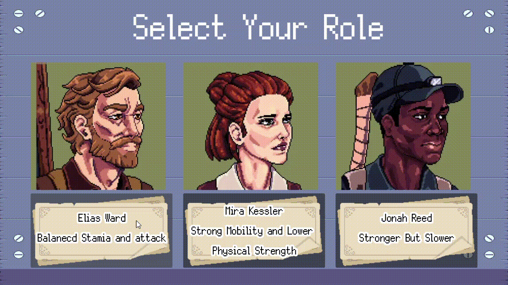

**UI Layout:**

The interface uses the Paper UI System assets for a thematic appearance:
- **Background**: NinePatchRect with book/desk texture
- **Title Label**: "Select Your Character" with custom LabelSettings
- **Portrait containers**: Three panels displaying cropped character portraits
- **Selection buttons**: Styled buttons beneath each portrait

Each handler sets `Global.selected_class` (0, 1, or 2) and calls `_start_game()`, which loads the CityOutskirtsIntro scene. The selected class value persists in the Global autoload, ensuring all subsequent systems (Player stats, dialogue selection, story triggers) respond appropriately.

---

### Weather System Integration

I integrated the Weather2D shader-based weather system into gameplay scenes to enhance atmospheric immersion. The system is implemented through [Weather2D/sky_setting.tscn](final-proj/Weather2D/sky_setting.tscn) which is instanced in level scenes.

**Weather Features:**

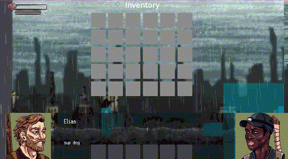

The Weather2D system provides:
- **Dynamic sky gradients**: Smooth color transitions for time-of-day effects
- **Cloud rendering**: Procedural cloud patterns via shader
- **Rain/snow particles**: Weather effects using GPU particles
- **Screen raindrops**: Overlay effect simulating water droplets on camera

The shaders are located in [Weather2D/shader/](final-proj/Weather2D/shader/):
- `shader_clouds.gdshader`: Procedural cloud generation
- `shader_rain_snow.gdshader`: Precipitation particle effects
- `shader_raindrops_on_screen.gdshader`: Screen-space water droplet overlay
- `shader_water.gdshader`: Water surface reflections

In CityOutskirtsIntro.tscn, the `sky_setting.tscn` is instanced to add weather ambiance without requiring manual shader setup in each scene.

---

## Subrole Contributions

Beyond my main responsibilities, I provided technical support and mentorship to team members:

**Map Design Mentorship (Fanxi Xu):**
I taught Fanxi how to use Godot's TileMap system for level design, including:
- Creating and configuring TileSet resources from sprite sheets
- Painting tiles with proper collision shapes
- Using multiple TileMap layers for foreground/background separation
- Implementing autotile rules for natural-looking terrain transitions

**Buff System Design Assistance:**
I collaborated on the architecture of the buff system, helping design:
- The `BuffType` enum for categorizing effects (Speed, Attack, Stamina Regen, HP Regen)
- The `add_buff()` interface with type, value, and duration parameters
- The `get_total()` aggregation function for stacking multiple buffs of the same type
- Integration points in Player.gd where buffs modify gameplay (movement speed, damage calculation, stamina regeneration)

**Multiplayer Architecture Consultation:**
I provided guidance on the multiplayer implementation, particularly regarding:
- Player instantiation and differentiation for local co-op

**Bug Fixes Across Codebase:**

Throughout development, I identified and resolved numerous issues:
- **Animation state machine**: Fixed transitions getting stuck when interrupted mid-animation
- **Collision layer conflicts**: Resolved player-enemy-projectile interaction issues by properly configuring layer/mask bits
- **Audio playback**: Fixed overlapping sounds and implemented variation systems to prevent repetition
- **Save/load integration**: Ensured character selection persists through save/load cycles and stats are properly restored

**See Narration and dialogue (William Yu & Siyun Chen)**

---

## User Interface (William Yu)

### Main Menu

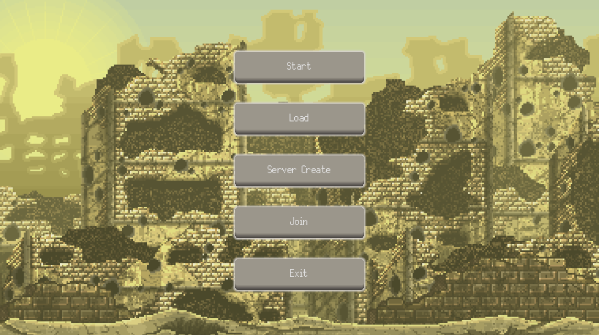

The main menu is the first interface the player encounters when launching the game, providing a clear and functional gateway into all major gameplay modes. It includes the Start, Load, Server Create, Join, and Exit buttons, all arranged in a centered vertical layout to maintain visual simplicity and ease of navigation. Each button uses Godot’s built-in theme and style properties to create a hover button effect, allowing the player to easily recognize interactive elements and improving overall usability. In addition to implementing the menu structure, I set up the scene hierarchy, configured each button’s signal connections, and ensured that every option transitions to the appropriate game state or scene. The background artwork, featuring a pixel-art ruined cityscape, establishes the game’s post-apocalyptic tone from the very beginning, immersing the player before gameplay starts.


### Save & load

The save and load interface provides players with a convenient way to manage their game progress and is fully integrated into the main menu system. When the player selects Load from the main menu, the interface communicates with the [save and load manager](final-proj/scripts/UIs/Save&Load/save_load_manager.gd) to retrieve stored save files and display them in a structured list. Each save entry is generated using the game’s SceneData format, which captures essential information about the player state, scene, and inventory at the time of saving. The interface then allows the player to select a save slot and seamlessly transition back into the corresponding scene. Similarly, when creating new progress, the Start button initializes a fresh game state managed by the same system, ensuring consistency between new sessions and loaded ones. By connecting UI button signals directly to the save/load system, the menu acts as the central hub that guides the player into either continuing past adventures or beginning a new one.

### Inventory

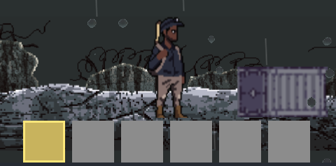

The inventory system is designed as a simple and intuitive hotbar interface that allows the player to quickly access essential items during gameplay. It consists of a row of item slots placed at the bottom of the screen, giving the player a constant and unobtrusive view of their current equipment. Each slot is implemented using a PanelContainer, and the currently selected slot is visually distinguished with a yellow border and background, providing clear feedback about which item is active at any moment.

The core logic is handled by the Inventory.gd script, which maintains the player’s item stacks, updates slot icons and quantities, and manages switching between slots using keyboard shortcuts. When the player picks up items in the world, they are automatically added to the first available slot or stacked with existing items of the same type. The hotbar UI refreshes dynamically to reflect new items, removed items, or changes in quantity, ensuring the player always has accurate information during fast-paced gameplay.

Beyond the hotbar, the inventory system includes an expanded storage view that can be opened by pressing Tab. This full inventory holds additional items that do not fit in the hotbar and is designed for more detailed item management. Players can rearrange items freely—for example, dragging an item from the expanded inventory into an empty hotbar slot to quickly equip it for immediate use. This interaction between the hotbar and the full inventory creates a flexible and efficient workflow, enabling players to organize their equipment strategically while maintaining a clean, minimalist UI that supports both moment-to-moment action and broader inventory management.


### Chatbox

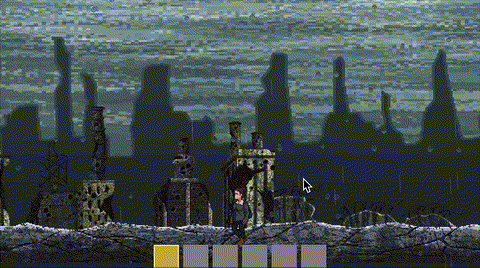

The chatbox UI is implemented as a standalone chatbox.tscn scene controlled by the DialogueManager.gd script. The UI consists of a speaker-name label, a text label for dialogue content, and two avatar TextureRect nodes that let characters appear on either the left or right side depending on the current line. A choice container and a hidden template button allow the chatbox to display interactive dialogue choices when needed. All of these nodes are exposed as exported variables so the manager can update them at runtime.

Dialogue content is data-driven and stored in custom Resource files. A DialogueGroup resource contains an ordered list of Dialogue entries, each specifying the character name, dialogue text, avatar texture, and whether the avatar appears on the left or right. A line may also include a list of DialogueChoice resources, which define the text of each choice and can optionally require or set story flags, jump to a new DialogueGroup, or trigger a scene change. This structure allows conversations and branching paths to be authored visually in the editor without modifying code.

When the game calls start_dialogue(group), the manager becomes active, shows the chatbox, and begins presenting lines with display_next_dialogue(). Clicking on the chatbox advances the conversation unless choices are currently visible, in which case the player must select a button. When choices appear, the manager duplicates the template button for each valid choice and connects their signals to _on_choice_selected(), which handles flag updates, branching, or scene transitions.

A typewriter effect is handled using a [tween](https://github.com/Acceltra65535/ProjektGameplay/blob/c0e447c07cc68c0c91ea6e5e91f6eea011a16387/final-proj/scripts/UIs/Dialogue/dialogue_manager.gd#L21), which is an embedded system in godot. When displaying a new line, the manager clears the text label and schedules a series of tween callbacks—each appending one character at a short interval—so the dialogue appears gradually. If the player clicks while text is still typing, the tween is canceled and the full line is shown instantly.

## Subrole:
### Narration and dialogue (William Yu & Siyun Chen)

As the narrative designer on the project, I built a modular dialogue system designed to support character-specific introductions, branching scenes, and tone-sensitive storytelling. At the core is a custom architecture built around Dialogue, DialogueGroup, and DialogueChoice resources. This structure allows us to write and organize narrative content cleanly, without needing to dig into the gameplay logic—keeping things both scalable and writer-friendly.

To expand on that, I developed the StoryDialogueLibrary, a scriptable system that procedurally assembles the introductory sequences for our three main characters: Elias, Mira, and Jonah. Each intro is made up of hand-authored dialogue beats, deliberately arranged to express character voice, emotional tone, and narrative motif. For example: Elias’s intro leans into themes of memory loss and guilt; Mira’s reflects her survival instincts, distrust, and sharp-edged humor; and Jonah’s explores societal amnesia and quiet philosophical unease. Each line in these sequences carries metadata—like speaker name, avatar ID, and camera-side placement—so we can layer in visual storytelling cues such as shifting perspectives, mirrored dialogues, and echo-like voice overlays.

When dialogue lines include player choices, the system transitions smoothly into an interactive mode, displaying dynamically generated buttons based on DialogueChoice data. These choices feed directly into story flags and determine the path through future dialogue groups, creating branching interactions that feel meaningful. Because the entire system is data-driven and modular, we’re able to maintain a consistent pipeline from authored narrative to in-game presentation—where tone, pacing, and player interaction all work together. The result is a story layer that not only feels integrated with gameplay, but also preserves the distinct voice and thematic direction of each character.

A sample dialogue script I wrote to push the story forward: [DialogueScript](final-proj/dialogues/DialogueScipts.docx)

### Resources used:

- [Chatbox](https://youtu.be/7c7aZTUITD4?si=ime2pJTvMtp_OIQz)
- [Save&Load](https://youtu.be/wSq1QJ-g91M?si=ZH1QeEi7BJYlGch4)

---

## Main role:Props (Zijian Li)

## Item & Inventory System

The Item & Inventory System is a core component of gameplay experience, responsible for managing all resources and items players acquire, consume, and organize throughout the game. This system employs a modular architecture comprising four parts: Item, ItemStack, InventoryData, and ItemPickup. Together, they form a stable, scalable, and easily debugged item framework.

Item Data Structure (Item / ItemStack)

Each item is represented by an **Item resource file (.tres)** containing its unique ID, name, icon, description, and item type (e.g., consumable, weapon, building material). Items themselves do not store quantity information; quantities are managed by ItemStack objects.

Item: Describes the item's static data

ItemStack: Represents “Item × Quantity,” supporting stacking, splitting, and merging

This separation ensures the item system's data maintainability and scalability: Item definitions can be edited independently, while quantity logic is handled by runtime stack objects.

Inventory (InventoryData)

The inventory consists of two parts:

Main Inventory (30 slots)

Quickbar (6 slots)

System Support:

✔ Automatic stacking (merging identical items)
✔ Automatic slot detection
✔ Item removal and quantity updates
✔ Swapping between main inventory and hotbar
✔ UI refresh notification via signals

All logic is managed by the InventoryData.gd script, which includes functionalities like add_item, remove_item, swap, and get_item_count.

This system is designed with a separation of data and UI layers: the UI handles presentation, while InventoryData manages actual calculations and data updates.

World Pickup System (ItemPickup)

When enemies drop loot or players open chests, an interactive ItemPickup node is generated. This node features:

Floating animation (bob animation)

Automatic player magnetism (magnetic attraction)

Auto-pickup delay

Icon auto-binding to the Item's icon

When the player touches to pick up the item:

ItemPickup attempts to add the corresponding stack to InventoryData

If fully stored → Self-destructs automatically

If partially stored → Updates remaining quantity and continues hovering

If inventory is full → Remains stationary

This system provides instant feedback (sound effects + animations) and effectively supports the game's pacing.

---

## Buff Factory System

The Buff system grants players temporary stat boosts, such as increased movement speed, enhanced stamina regeneration, or boosted attack power. Designed as an independent functional module, it ensures decoupling from character and item systems.

Buff Data Structure

Each Buff contains:

Buff type (Speed, Attack, HP Regeneration, etc.)
Buff value (e.g., +20% Speed)
Duration
Remaining runtime

The BuffSystem maintains all active Buffs as an array, managing countdowns and cleanup in _process(delta).

Buff Calculation Model

When a character queries a specific ability (e.g., Speed buff):

get_total(BuffType.SPEED)

The system aggregates all active buffs of the same type and returns the final bonus value.

This design offers high composability—for example, two different drinks providing Speed buffs will stack their effects.

Buff Factory (Consumables) Integration

Each consumable invokes BuffSystem upon use:

Example: Energy drink provides +20% Speed for 30 seconds:

buff_system.add_buff(BuffType.SPEED, 0.2, 30.0)

Example: Nutrition supplement increases Stamina Regeneration:

buff_system.add_buff(BuffType.STAMINA_REGEN, 0.4, 20.0)


The Buff Factory design ensures:

Each consumable only needs to define its buff behavior

No modification to Player or Inventory logic

Future additions of new items require no changes to the underlying system, enabling high scalability.

## Health & Stamina UI System

## System Integration and Design Motivation

The Item System, Buff System, and UI form a complete feedback loop:

Player picks up an item

The item links to character attributes via the BuffSystem

Character attributes are reflected in real-time on the UI (health bar, stamina bar, speed, attack, etc.)

Player makes next action based on UI information

This closed-loop design creates natural, strong, and intuitive feedback, enhancing the overall player experience.

---

## Systems and Tools Engineer (Alex Yuan)

## Multiplayer feature

Developed using the Godot engine, the game features a local multiplayer co-op system. By refactoring the input processing logic and character instantiation mechanisms, we successfully embedded multiplayer interaction functionality into the existing single-player gameplay, supporting multiple controllers and split-screen/shared-screen co-op. In terms of technical details, we designed limited resource allocation and shared camera logic specifically for local multiplayer, significantly enhancing the game's replay value and social aspects.

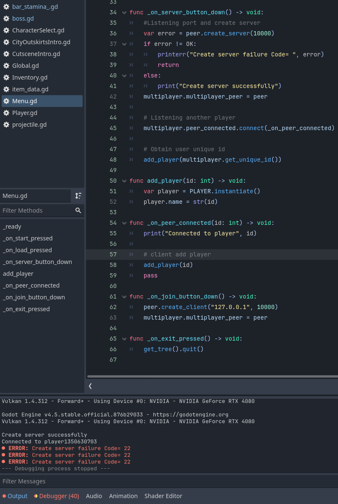

Established a foundational Client-Server network architecture within Godot, marking the transition from a standalone to a multiplayer environment. The core of this implementation focuses on connection stability and identity management. Specifically, I have engineered a handshake mechanism where the server detects incoming connections and assigns a unique Peer ID to each client. This ensures that every session is distinct and correctly routed.

Implemented a bidirectional resource sharing system. This data pipeline allows the server to synchronize essential game assets and states with connected clients, ensuring consistency across all instances.

## Boss navigation basic feature

The basic movement logic for the boss character has been designed and implemented. This includes tracking, pre-attack warning signals, and multi-stage state transitions.

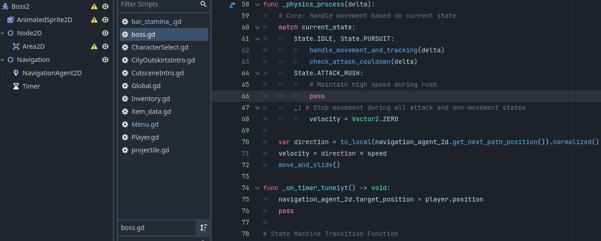

Implemented autonomous navigation logic for the Boss entity, The project now supports a multiplayer environment where connected players can encounter a Boss capable of intelligent, map-aware movement.

## Sub role

Find bug and fix it.

The scene switching bug has been fixed, and the client-side synchronization logic has been modified.

---

## Map/Scene Design (Fanxi Xu)

## Stage 2

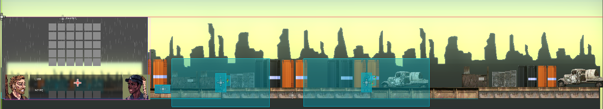

## Stage 3

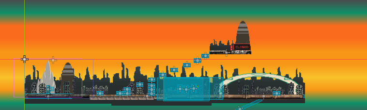
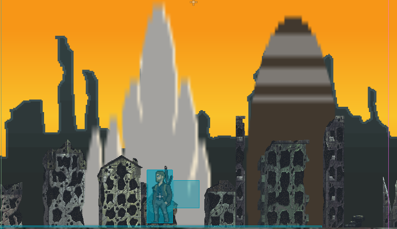
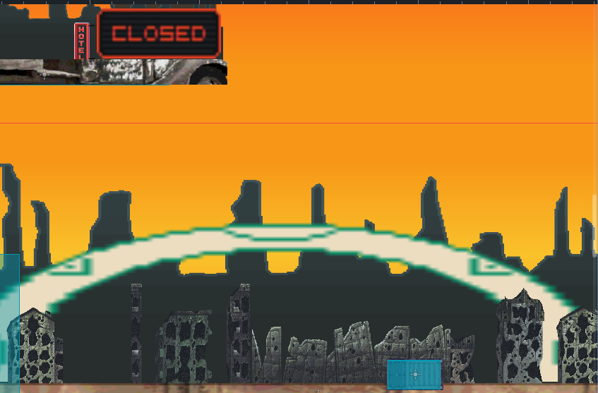

## Stage 4

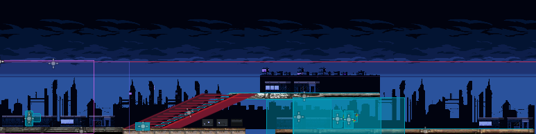
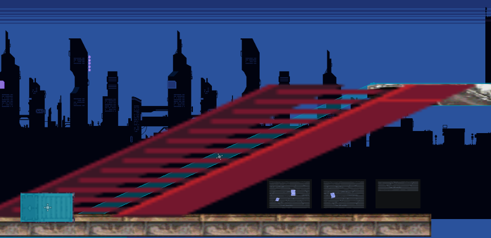

---

## AI Design (Yuanzhen Wu)


### New Enemies
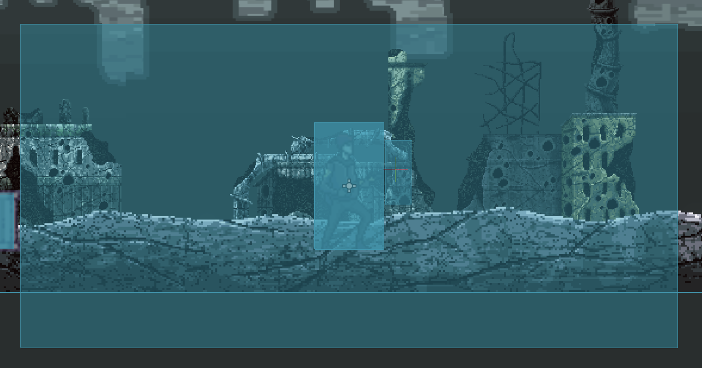

Enemies named Raider were designed; their logic involves close-range melee attacks at short distances and firing shots at long ranges. A 3-second aiming time was added to allow players to counter their actions.


### BOSS Designed
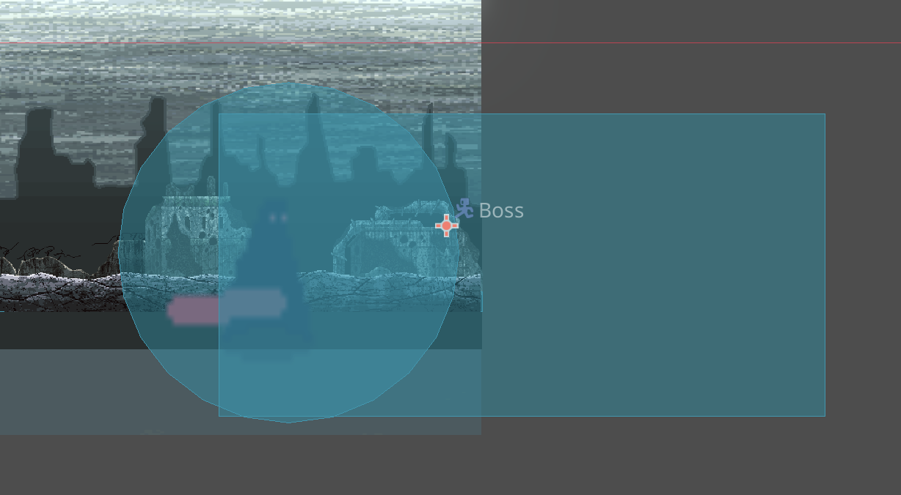

Added elite monsters (BOSS) with close-range area attacks, including a combo of Whirlwind Slash and Vertical Slash, and another featuring an Rushing attack. (Due to personal health emergency, test by my teammates.)

## Conclusion

These three systems collectively form the game's core feedback layer, tightly integrated with the combat system, character system, and level system. Their advantages include:

High scalability (easily add new items, buffs, or UI effects)

Data-driven (easy to debug and balance)

Architectural decoupling (each system has a single, clear responsibility)

Excellent gameplay experience (instant feedback + animated reinforcement + clear information)


